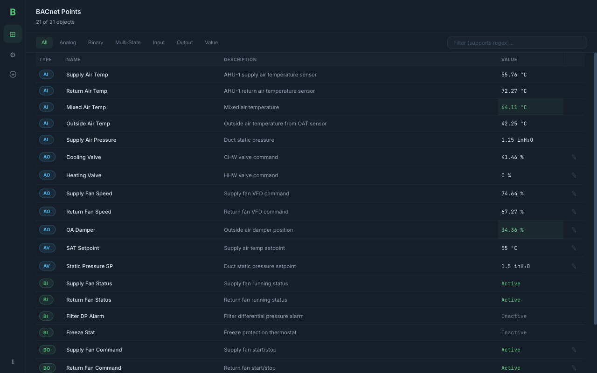
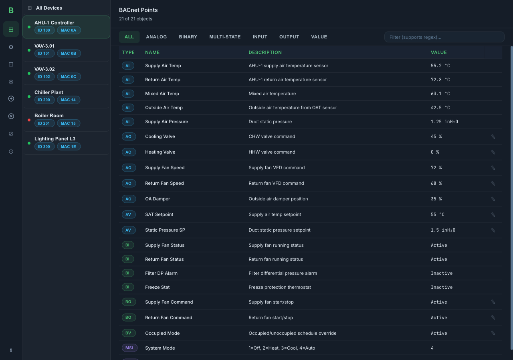
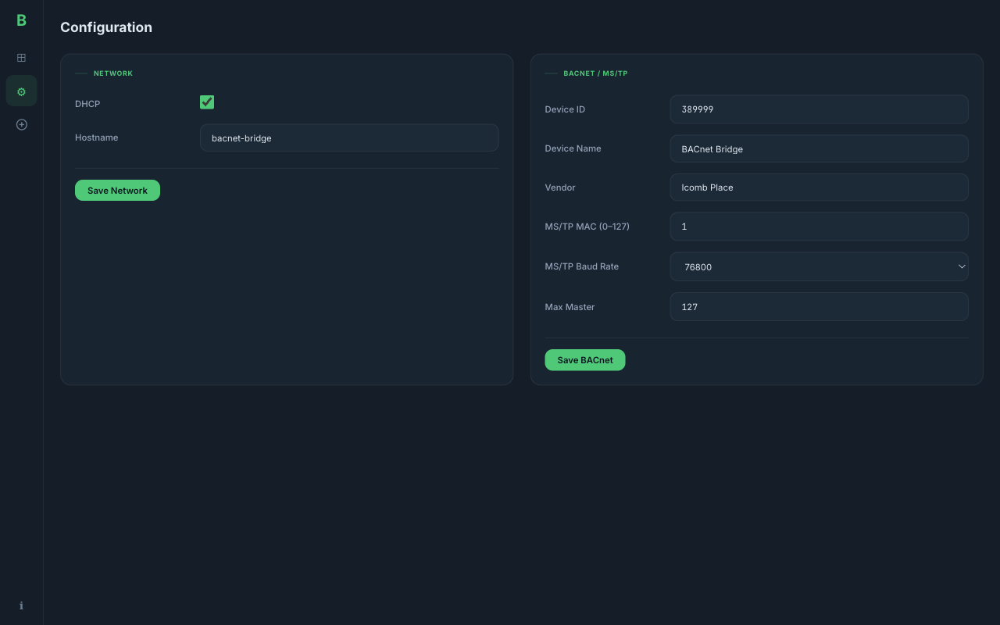
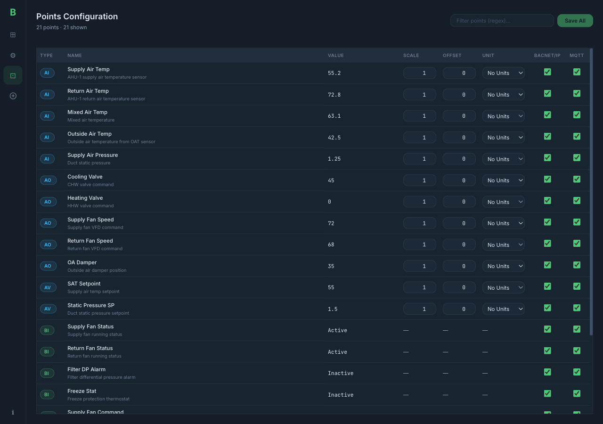
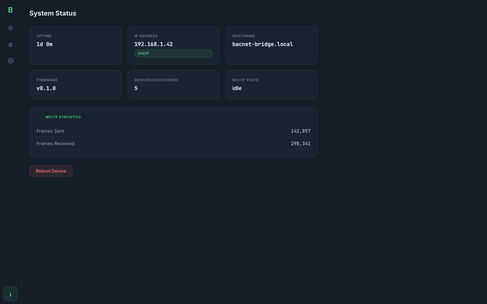

# micro-bacnet-bridge

BACnet MS/TP to BACnet/IP bridge running on WIZnet W5500-EVB-Pico2 (RP2350A).

Hybrid Rust + C firmware: embassy-rs async networking on Core 0, bacnet-stack MS/TP master on Core 1.

**Vendor:** Icomb Place

## Live Dashboard



Point values update in real time via Server-Sent Events. Changed values flash green.

## Screenshots

| Dashboard | Configuration |
|-----------|--------------|
|  |  |

| Points Configuration | System Status |
|---------------------|---------------|
|  |  |

## Hardware

| Board | MCU | RAM | Flash | Target |
|-------|-----|-----|-------|--------|
| W5500-EVB-Pico2 | RP2350A (Cortex-M33 @ 150 MHz) | 520 KB | 4 MB | `thumbv8m.main-none-eabihf` |

Pin mapping:
- **Ethernet:** W5500 hardwired TCP/IP via SPI0 (GPIO16-21)
- **RS-485:** SP3485 transceiver on UART1 (GPIO4=TX, GPIO5=RX, GPIO3=DE/RE)
- **Power:** 802.3af PoE via RJ45

### SWD Debugging

Use a WIZnet W5500-EVB-Pico-PoE (RP2040) flashed with [debugprobe](https://github.com/raspberrypi/debugprobe/releases) firmware as a debug probe:

| Signal | Probe (RP2040) | Target (RP2350A) |
|--------|---------------|-----------------|
| SWCLK | GPIO2 | SWCLK test pad |
| SWDIO | GPIO3 | SWDIO test pad |
| GND | GND | GND |

```bash
probe-rs run --chip RP2350 target/thumbv8m.main-none-eabihf/release/firmware
```

## Architecture

```
Core 0 (Rust / embassy-rs)           Core 1 (C / bacnet-stack)
┌──────────────────────┐             ┌────────────────────┐
│ embassy-net + W5500   │   shared    │ MS/TP Master FSM   │
│ ┌──────────────────┐ │   ring buf  │ (bacnet-stack)      │
│ │ BACnet/IP :47808 │ │◄──────────►│ UART1 + SP3485      │
│ │ HTTP :80         │ │  +spinlock  │ DE/RE control       │
│ │ mDNS :5353       │ │             └────────────────────┘
│ │ MQTT :1883       │ │
│ │ SNMP :161        │ │
│ │ NTP / Syslog     │ │
│ │ DHCP + DNS       │ │
│ └──────────────────┘ │
│ bridge logic          │
│ config (flash)        │
└──────────────────────┘
```

## Features

- **Bidirectional BACnet bridge** — forwards all services between MS/TP and BACnet/IP
- **Web admin dashboard** — real-time point values with SSE, inline write, regex filter
- **Points configuration** — per-point scale/offset, engineering units, state text labels, exposure control
- **MQTT + Home Assistant** — publish point values, auto-discovery with configurable prefix
- **NTP time sync** — DHCP-discovered or manual NTP pool servers
- **SNMP v2c agent** — system MIB (sysDescr, sysUpTime, sysName) for network monitoring
- **Syslog (RFC 5424)** — ship logs to a central syslog server
- **mDNS/Bonjour discovery** — `bacnet-bridge.local`, `_http._tcp`, `_bacnet._udp` services
- **OTA firmware updates** — upload new firmware via HTTP, ARM vector table validation
- **DHCP + static IP** — auto-config with flash-persisted fallback
- **REST API** — full OpenAPI 3.1 spec at `/api/v1`
- **Engineering units** — 100+ BACnet unit codes mapped to HA unit strings with conversion
- **PoE powered** — single RJ45 cable for power + network
- **No cloud dependencies** — fully local operation

## Versioning

Firmware version format: `major.minor.build-board`

- **major.minor** from `Cargo.toml` (e.g., `0.1`)
- **build** auto-incremented by CI (`GITHUB_RUN_NUMBER`)
- **board** target platform (`pico` or `pico2`)

Examples: `0.1.42-pico2`, `0.1.0-pico2` (local build)

Version is exposed in: mDNS TXT records, `/api/v1/system/status`, SNMP sysDescr, startup log.

## Building

### Prerequisites

```bash
# Rust toolchain
rustup target add thumbv8m.main-none-eabihf
cargo install elf2uf2-rs

# C cross-compiler
brew install arm-none-eabi-gcc    # macOS
# apt install gcc-arm-none-eabi   # Ubuntu

# Frontend (uses bun, not npm)
curl -fsSL https://bun.sh/install | bash
```

### Build

```bash
# Frontend
cd frontend && bun install && bun run build && cd ..

# Embed web assets into firmware
python3 tools/embed_assets.py

# Build firmware (target from .cargo/config.toml: thumbv8m.main-none-eabihf)
cargo build -p firmware --release

# Convert to UF2
elf2uf2-rs target/thumbv8m.main-none-eabihf/release/firmware micro-bacnet-bridge.uf2
```

### Development (no hardware needed)

```bash
# Run bridge-core unit tests on Mac
cargo test -p bridge-core

# Check firmware compiles
cargo check -p firmware

# Run frontend dev server with mock data + SSE
cd frontend && bun run dev
```

## Flashing

### USB (first flash)
1. Hold BOOTSEL button on the board
2. Connect USB cable (or power cycle over PoE while holding BOOTSEL)
3. Copy `.uf2` file to the RPI-RP2 USB drive
4. Device reboots and starts the bridge

### OTA (subsequent updates)
1. Navigate to System Status in the admin UI
2. Upload the new `.bin` firmware file
3. Device validates the image and reboots automatically

## First Boot

1. Connect the device to your network via RJ45 (PoE or separate power)
2. The device obtains an IP via DHCP
3. Discover it: `dns-sd -B _http._tcp` or browse to `http://bacnet-bridge.local`
4. On first access, create an admin user
5. Configure BACnet settings (device ID, MS/TP MAC, baud rate)

## Admin UI Pages

| Page | Description |
|------|-------------|
| **Dashboard** | Live BACnet points with SSE updates, type badges, regex filter, tabs, inline write |
| **Config** | Network, BACnet/MS-TP, NTP, Syslog, SNMP, MQTT (with HA discovery) |
| **Points** | Per-point scale/offset, engineering units, state text labels, 4 exposure toggles (Dashboard/BACnet-IP/MQTT/API), pagination |
| **Users** | Create/delete users with admin/viewer roles |
| **Status** | Uptime, IP, hostname, firmware version, MS/TP stats, OTA update, reboot |

## Project Structure

```
micro-bacnet-bridge/
├── bridge-core/        # no_std Rust library (testable on host, 287 tests)
│   └── src/            # BACnet types, NPDU, mDNS, NTP, SNMP, MQTT, Syslog,
│                       # config, IPC, engineering units, OTA validation
├── firmware/           # RP2350A embassy binary
│   └── src/            # HTTP, SSE, mDNS, BACnet/IP, NTP, SNMP, MQTT,
│                       # Syslog, DNS, OTA, flash config, Core 1 launch
├── csrc/               # C code for Core 1 MS/TP
├── frontend/           # SvelteKit admin UI (Verdant UI design system)
├── tools/              # embed_assets.py, generate_docs.sh, pre-commit
├── docs/               # OpenAPI spec, screenshots
└── .github/workflows/  # CI build, tests, clippy, fmt, release
```

## API Documentation

OpenAPI 3.1 spec: [`docs/openapi.yaml`](docs/openapi.yaml)

| Method | Path | Description |
|--------|------|-------------|
| GET | `/api/v1/devices` | List discovered BACnet devices |
| GET | `/api/v1/devices/{id}/points` | List points for a device |
| PUT | `/api/v1/devices/{id}/points/{obj}` | Write a point value |
| GET | `/api/v1/config/network` | Network configuration |
| GET | `/api/v1/config/bacnet` | BACnet configuration |
| GET | `/api/v1/config/ntp` | NTP configuration |
| GET | `/api/v1/config/mqtt` | MQTT configuration |
| GET | `/api/v1/config/snmp` | SNMP configuration |
| GET | `/api/v1/config/syslog` | Syslog configuration |
| GET | `/api/v1/config/points` | Point configurations |
| GET | `/api/v1/system/status` | System status + firmware version |
| POST | `/api/v1/system/firmware` | OTA firmware upload |
| POST | `/api/v1/system/reboot` | Reboot device |
| GET | `/api/events` | SSE live point updates |

## License

MIT
