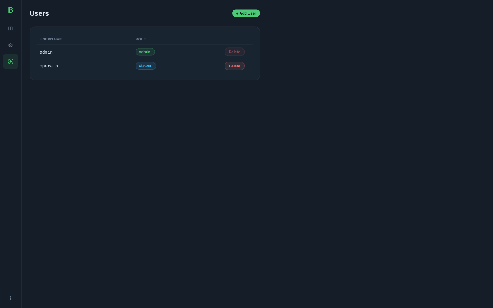

# micro-bacnet-bridge

BACnet MS/TP to BACnet/IP bridge running on the WIZnet W5500-EVB-Pico-PoE (RP2040 + W5500).

Hybrid Rust + C firmware: embassy-rs async networking on Core 0, bacnet-stack MS/TP master on Core 1.

**Vendor:** Icomb Place

## Live Dashboard


Point values update in real time via Server-Sent Events. Changed values flash green.

## Screenshots

| Dashboard | Configuration |
|-----------|--------------|
|  |  |

| Users | System Status |
|-------|---------------|
|  |  |

## Hardware

- **MCU:** RP2040 dual-core Cortex-M0+ @ 133 MHz, 264 KB SRAM, 2 MB flash
- **Ethernet:** W5500 hardwired TCP/IP via SPI0 (GPIO16-21)
- **RS-485:** SP3485 transceiver on UART1 (GPIO4=TX, GPIO5=RX, GPIO3=DE/RE)
- **Power:** WIZPoE-P1 802.3af PoE module via RJ45

### Wiring

```
RP2040          W5500-EVB-Pico (internal)
GPIO16  ────►   MISO
GPIO17  ────►   CS
GPIO18  ────►   SCK
GPIO19  ────►   MOSI
GPIO20  ────►   RST
GPIO21  ────►   INT

RP2040          SP3485
GPIO4   ────►   DI  (TX)
GPIO5   ◄────   RO  (RX)
GPIO3   ────►   DE + RE (direction)
```

## Architecture

```
Core 0 (Rust / embassy-rs)           Core 1 (C / bacnet-stack)
┌──────────────────────┐             ┌────────────────────┐
│ embassy-net + W5500   │   shared    │ MS/TP Master FSM   │
│ ┌──────────────────┐ │   ring buf  │ (bacnet-stack)      │
│ │ BACnet/IP :47808 │ │◄──────────►│ UART1 + SP3485      │
│ │ HTTP :80         │ │  +spinlock  │ DE/RE control       │
│ │ mDNS :5353       │ │             └────────────────────┘
│ │ DHCP             │ │
│ └──────────────────┘ │
│ bridge logic          │
│ config (flash)        │
│ auth                  │
└──────────────────────┘
```

## Features

- **Bidirectional BACnet bridge** — forwards all services between MS/TP and BACnet/IP
- **Web admin dashboard** — real-time point values, config, user management
- **mDNS/Bonjour discovery** — `bacnet-bridge.local`, `_http._tcp`, `_bacnet._udp` services
- **DHCP + static IP** — auto-config with flash-persisted fallback
- **REST API** — full OpenAPI 3.1 spec at `/api/v1`
- **SSE live updates** — point values stream at 1 Hz, only changed values
- **PoE powered** — single RJ45 cable for power + network
- **No cloud dependencies** — fully local operation

## Building

### Prerequisites

```bash
# Rust toolchain
rustup target add thumbv6m-none-eabi
cargo install elf2uf2-rs

# C cross-compiler
brew install arm-none-eabi-gcc    # macOS
# apt install gcc-arm-none-eabi   # Ubuntu

# Frontend
# Uses bun (not npm)
curl -fsSL https://bun.sh/install | bash
```

### Build

```bash
# Frontend
cd frontend && bun install && bun run build && cd ..

# Embed web assets into firmware
python3 tools/embed_assets.py

# Build firmware
cargo build -p firmware --release --target thumbv6m-none-eabi

# Convert to UF2
elf2uf2-rs target/thumbv6m-none-eabi/release/firmware micro-bacnet-bridge.uf2
```

### Development (no hardware needed)

```bash
# Run bridge-core unit tests on Mac
cargo test -p bridge-core

# Check firmware compiles
cargo check -p firmware --target thumbv6m-none-eabi

# Run frontend dev server with mock data + SSE
cd frontend && bun run dev
```

## Flashing

1. Hold BOOTSEL button on the W5500-EVB-Pico-PoE
2. Connect USB cable (or power cycle over PoE while holding BOOTSEL)
3. Copy `micro-bacnet-bridge.uf2` to the RPI-RP2 USB drive
4. Device reboots and starts the bridge

## First Boot

1. Connect the device to your network via RJ45 (PoE or separate power)
2. The device obtains an IP via DHCP
3. Discover it: `dns-sd -B _http._tcp` or browse to `http://bacnet-bridge.local`
4. On first access, create an admin user
5. Configure BACnet settings (device ID, MS/TP MAC, baud rate)

## Project Structure

```
micro-bacnet-bridge/
├── bridge-core/        # no_std Rust library (testable on host)
│   └── src/            # BACnet types, NPDU codec, mDNS, config, IPC
├── firmware/           # RP2040 embassy binary
│   └── src/            # HTTP, SSE, mDNS, BACnet/IP, flash, Core 1
├── csrc/               # C code for Core 1 MS/TP
├── frontend/           # SvelteKit admin UI (Verdant UI design system)
├── tools/              # embed_assets.py
├── docs/               # OpenAPI spec, screenshots
└── .github/workflows/  # CI/CD
```

## API Documentation

OpenAPI 3.1 spec: [`docs/openapi.yaml`](docs/openapi.yaml)

Key endpoints:

| Method | Path | Description |
|--------|------|-------------|
| GET | `/api/v1/devices` | List discovered BACnet devices |
| GET | `/api/v1/devices/{id}/points` | List points for a device |
| PUT | `/api/v1/devices/{id}/points/{obj}` | Write a point value |
| GET | `/api/v1/config/network` | Network configuration |
| GET | `/api/v1/config/bacnet` | BACnet configuration |
| GET | `/api/v1/system/status` | System status |
| GET | `/api/events` | SSE live point updates |

## License

MIT
